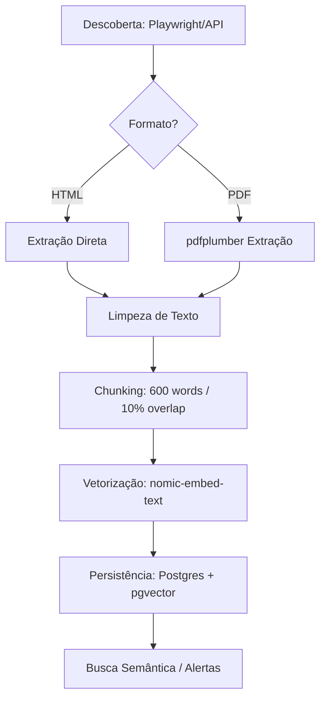
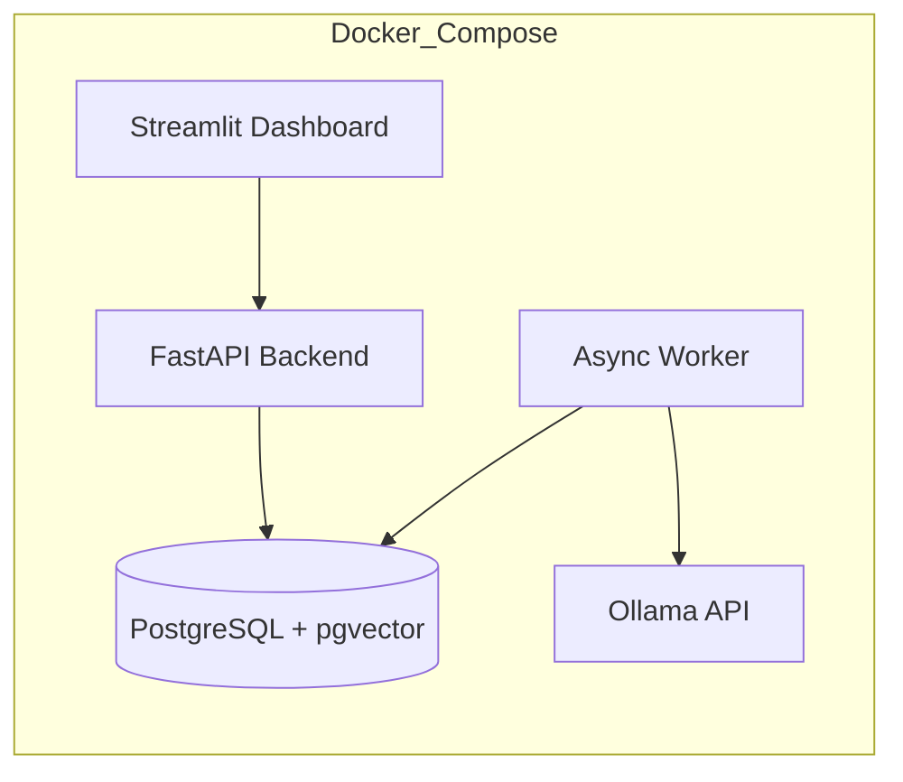

# Manifesto Técnico: Arquitetura RAG Local DOE-BA

Este documento detalha as decisões arquiteturais e o fluxo de dados do **DOE-BA Intelligence Engine**.

## 1. O Fluxo RAG (Retrieval-Augmented Generation)

O sistema opera um pipeline de dados assíncrono projetado para transformar PDFs e HTMLs governamentais em conhecimento acionável.

### A. Ingestão e Captura (Core Engine)
- **Descoberta:** O sistema consulta as APIs do Diário Oficial para identificar novas edições.
- **Resiliência Legada:** O servidor alvo utiliza Apache/2.2.22. Para evitar bloqueios por exaustão de conexões ou comportamento "bot-like":
    - **Semaphore(8):** Limitamos a concorrência a no máximo 8 requisições simultâneas.
    - **Jitter:** Introduzimos um delay aleatório de 200ms a 500ms entre as chamadas.
- **Parsing Híbrido:** 
    - **HTML:** Extração direta via sumário para atos padrão.
    - **PDF:** Uso de `pdfplumber` para extrair texto de atos anexos, garantindo que o conteúdo binário não seja processado como texto.

### B. Processamento e Limpeza (Intelligence Layer)
- **Limpeza:** Remoção de ruídos (cabeçalhos, rodapés, marcas d'água).
- **Chunking:** O texto é quebrado em blocos de aproximadamente **600 palavras** com **10% de sobreposição (overlap)**. Isso garante que o contexto não seja perdido entre os blocos.

### C. Funil de Inteligência (Classificação)
Cada ato passa por três camadas de análise:
1. **Camada 1 (Lexical/Regex):** Filtro ultra-rápido para palavras-chave da `watchlist.yaml`.
2. **Camada 2 (NER/Spacy):** Identificação de entidades (Pessoas, Locais, Valores) usando modelos estatísticos.
3. **Camada 3 (LLM/Ollama):** Uso do `qwen2.5:1.5b` para análise semântica final e resumo se necessário.

### D. Vetorização e Persistência
- **Embeddings:** Os chunks são convertidos em vetores de 768 dimensões usando o modelo `nomic-embed-text`.
- **Busca Semântica:** O `pgvector` permite consultas de similaridade de cosseno em milissegundos, permitindo encontrar temas correlatos mesmo que os termos exatos não coincidam.

### E. Diagrama de Fluxo de Dados (PDF para Vetor)

## 2. Filosofia Local-First

O projeto foi construído sob o princípio de **Soberania de Dados**:
- **Compliance LGPD:** Nenhum dado pessoal contido no Diário Oficial sai da rede local do usuário.
- **Eficiência de Custo:** Toda a inteligência é "gratuita" após o download do modelo, sem taxas por tokens ou assinaturas SaaS.
- **Latência:** A busca semântica local elimina a latência de rede de APIs externas.

### Orquestração de Serviços

## 3. Modelo de Dados (PostgreSQL)

O esquema é otimizado para RAG:
- `atos_oficiais`: Armazena o metadado e o texto integral processado.
- `atos_chunks`: Armazena os fragmentos de texto vinculados ao `ato_id` e seu respectivo `vector`.
- `system_settings`: Configurações dinâmicas de polling e monitoramento.

---
*Este manifesto serve como guia para manter a integridade e o propósito original do sistema durante evoluções futuras.*
