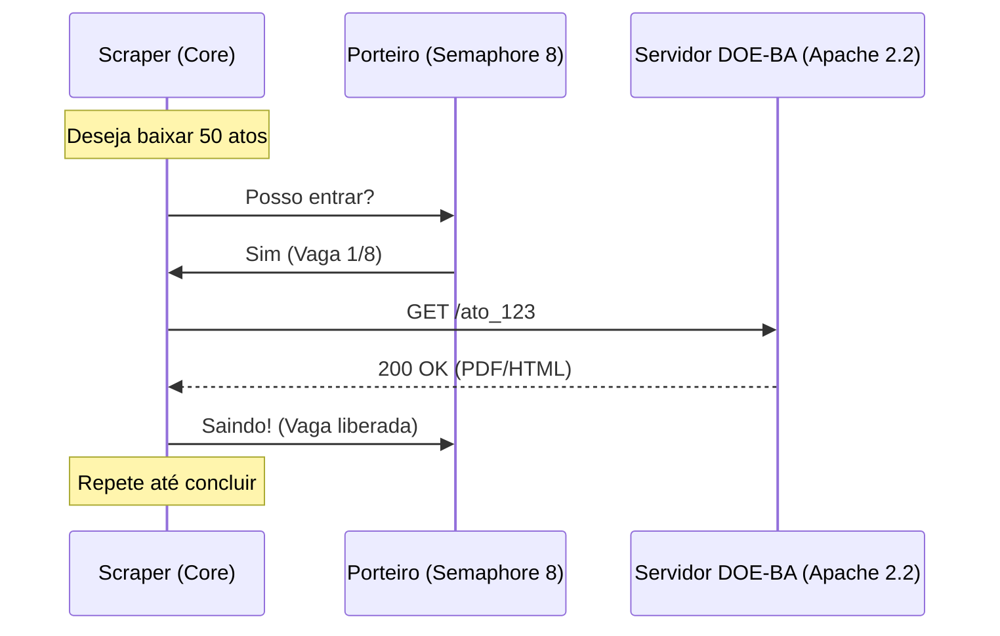

# Capítulo 01: Fundamentos de Web Scraping
> "Antes de correr, precisamos aprender a caminhar silenciosamente pelos corredores digitais."

## 🎓 O que você vai aprender?
* Como o protocolo HTTP funciona na prática.
* A diferença vital entre raspagem síncrona e assíncrona.
* Como respeitar servidores antigos (Apache 2.2.22) sem ser bloqueado.

---

## 1. O Beabá: Protocolo HTTP e Verbos

Imagine que o servidor do Diário Oficial é um **bibliotecário** muito ocupado e um tanto rigoroso. Para falar com ele, você usa o protocolo HTTP.

- **GET (O Pedido):** É quando você pergunta: "Você tem a edição do dia 09/05?". Você apenas lê os dados.
- **POST (A Entrega):** É quando você preenche um formulário (ex: login) e entrega dados ao servidor.
- **Status Codes (As Respostas):**
    - **200 OK:** "Aqui está o que você pediu." (Sucesso!)
    - **404 Not Found:** "Essa página não existe." (Erro no caminho)
    - **500 Internal Server Error:** "O bibliotecário tropeçou." (Erro no servidor)

---

## 2. Síncrono vs Assíncrono: A Analogia da Cafeteria

No modelo **Síncrono (Requests)**, você pede um café e fica parado no balcão esperando. Você não faz mais nada até o café chegar.

No modelo **Assíncrono (Httpx + Asyncio)**, você pede o café, recebe um pager e vai ler um livro. Quando o café está pronto, o pager toca. No DOE-BA, usamos `asyncio` para fazer múltiplas perguntas ao servidor ao mesmo tempo, sem ficar "parado" esperando a resposta de uma para começar a outra.

---

## 3. O Desafio do Apache 2.2.22: O Velho Bibliotecário

O servidor do DOE-BA usa uma tecnologia antiga (Apache 2.2.22). Se você tentar fazer 100 perguntas ao mesmo tempo (requisições paralelas), ele vai se assustar e te expulsar (bloqueio de IP).

### A Solução: `asyncio.Semaphore(8)`
Pense no Semáforo como um **porteiro** que só deixa 8 pessoas entrarem na biblioteca por vez. 
- Quando um worker termina de baixar um arquivo, ele sai, e o porteiro deixa o próximo entrar.
- Isso mantém a velocidade alta, mas dentro do limite que o servidor aguenta.

---

## 4. Para Aprofundar

> [!IMPORTANT]
> **Material de Estudo Obrigatório:** 
> Assista às **"Lives de Python" (canal do Eduardo Mendes/Dunossauro)**, especificamente da **#20 à #27**. Lá ele destrincha Selenium, Requests e a arte de navegar no DOM.

- **Pesquise sobre:** "HTTP Keep-Alive" e como ele economiza recursos em raspagens longas.
- **Estude o padrão:** "Page Object Pattern" para organizar seus seletores CSS/XPath.

---

---
[Voltar para o Índice](README.md) | [Próximo Capítulo: IA Local](02-inteligencia-artificial-local.md)
