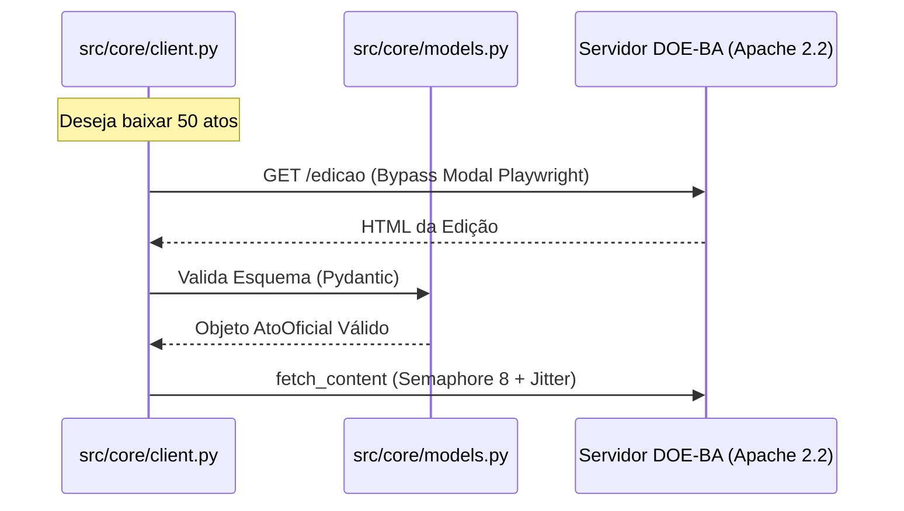

# Capítulo 01: Fundamentos de Web Scraping
> "Antes de correr, precisamos aprender a caminhar silenciosamente pelos corredores digitais."

## 🎓 O que você vai aprender?
* Como o protocolo HTTP funciona na prática.
* A diferença vital entre raspagem síncrona e assíncrona.
* Como respeitar servidores antigos (Apache 2.2.22) sem ser bloqueado.

---

## 1. O Beabá: Protocolo HTTP e Verbos

Imagine que o servidor do Diário Oficial é um **bibliotecário** muito ocupado e um tanto rigoroso. Para falar com ele, você usa o protocolo HTTP.

- **GET (O Pedido):** É quando você pergunta: "Você tem a edição do dia 09/05?". Você apenas lê os dados.
- **POST (A Entrega):** É quando você preenche um formulário (ex: login) e entrega dados ao servidor.
- **Status Codes (As Respostas):**
    - **200 OK:** "Aqui está o que você pediu." (Sucesso!)
    - **404 Not Found:** "Essa página não existe." (Erro no caminho)
    - **500 Internal Server Error:** "O bibliotecário tropeçou." (Erro no servidor)

---

## 2. Síncrono vs Assíncrono: A Analogia da Cafeteria

No modelo **Síncrono (Requests)**, você pede um café e fica parado no balcão esperando. Você não faz mais nada até o café chegar.

No modelo **Assíncrono (Httpx + Asyncio)**, você pede o café, recebe um pager e vai ler um livro. Quando o café está pronto, o pager toca. No DOE-BA, usamos `asyncio` para fazer múltiplas perguntas ao servidor ao mesmo tempo, sem ficar "parado" esperando a resposta de uma para começar a outra.

---

## 🔍 Mergulho no Código: Onde a Mágica Acontece

Nesta plataforma, a teoria se traduz em arquivos específicos:

### A. Resiliência e Polidez
No arquivo `src/core/client.py`, implementamos o **Porteiro Digital** usando:
```python
self.semaphore = asyncio.Semaphore(8)
```
Isso garante que nunca ultrapassaremos 8 conexões simultâneas, respeitando as limitações do **Apache/2.2.22** da EGBA e evitando bloqueios por exaustão de recursos.

### B. O Bypass do Modal
O servidor da EGBA costuma exibir um modal informativo ("CONTINUAR SEM CADASTRO"). Para automatizar a descoberta de novas edições, usamos o **Playwright** em `src/core/client.py` (método `get_edition_metadata_html`), que simula o clique humano antes de capturar o HTML da página.

### C. Integridade do Dado (Pydantic)
Antes de qualquer processamento, o dado bruto é validado pelo arquivo `src/core/models.py`. Usamos o `AtoOficial(BaseModel)` do **Pydantic** para garantir que cada ato tenha um identificador, título e texto integral válidos. Se o dado estiver quebrado, ele nem entra no funil de IA.

---

## 4. Para Aprofundar

> [!IMPORTANT]
> **Material de Estudo:** 
> - **Pesquise por:** "Asyncio Semaphores em Python" para entender como gerenciar concorrência.
> - **Estude o padrão:** "Page Object Pattern" e como o Playwright lida com SPAs.

---



---
[Voltar para o Índice](README.md) | [Próximo Capítulo: IA Local](02-inteligencia-artificial-local.md)
