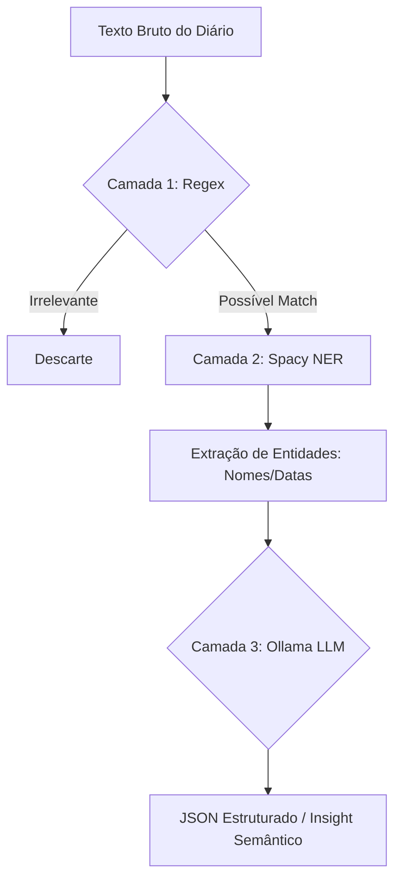

# Capítulo 02: Inteligência Artificial Local
> "Por que pedir permissão à nuvem, se você pode ser o mestre do seu próprio cérebro digital?"

## 🎓 O que você vai aprender?
* A diferença entre IA Generativa (LLMs) e NLP Estatístico (NER).
* A estratégia do "Funil de Inteligência" para economia de hardware.
* Como rodar o Ollama via Docker e baixar modelos.

---

## 1. O Duelo: LLM vs NER

No laboratório do DOE-BA, usamos dois tipos de "cérebros":

- **NLP Estatístico (Spacy/NER):** Imagine um **especialista em etiquetas**. Ele é muito rápido e treinado apenas para reconhecer nomes de pessoas, organizações e datas. Ele não sabe conversar, mas sabe identificar entidades num piscar de olhos.
- **IA Generativa (LLM/Ollama):** Imagine um **poliglota erudito**. Ele entende nuances, sarcasmo e consegue resumir textos complexos. Ele é lento e exige muita memória, mas é extremamente inteligente.

---

## 2. A Estratégia do Funil: Poupando Energia

Não usamos um LLM caro para ler cada linha do Diário Oficial. Isso seria como usar uma Ferrari para ir até a padaria na esquina. Usamos um **funil de triagem**:

1. **Regex (Filtro de Areia):** Um código simples que busca palavras-chave (ex: "Licitação"). Se não achar nada, descarta o texto instantaneamente.
2. **NER (Filtro de Água):** O Spacy entra em ação para extrair nomes e valores dos textos que passaram pelo Regex.
3. **LLM (O Destilador):** Apenas os textos mais importantes chegam ao `qwen2.5:1.5b` do Ollama para uma análise semântica profunda e estruturação final.

---

## 3. Prática: O Coração Local (Ollama)

O Ollama roda dentro de um container Docker, isolado e seguro.

### Comandos de Mestre:
Para baixar o modelo que usamos, você abre o terminal e digita:
```bash
docker exec -it doe_ollama ollama pull qwen2.5:1.5b
```

---

## 4. Para Aprofundar

- **Analogia da Matrix:** Imagine que o **Spacy** é o código verde da Matrix (vê a estrutura), enquanto o **Ollama** é o Neo (entende o significado e o propósito).
- **Pesquise sobre:** "Quantização de modelos (GGUF)". Entenda como modelos gigantes cabem em computadores comuns.
- **Estude o conceito:** "Zero-shot vs Few-shot Prompting".

---



---
[Voltar para o Índice](README.md) | [Próximo Capítulo: RAG e Vetores](03-arquitetura-rag-e-vetores.md)
