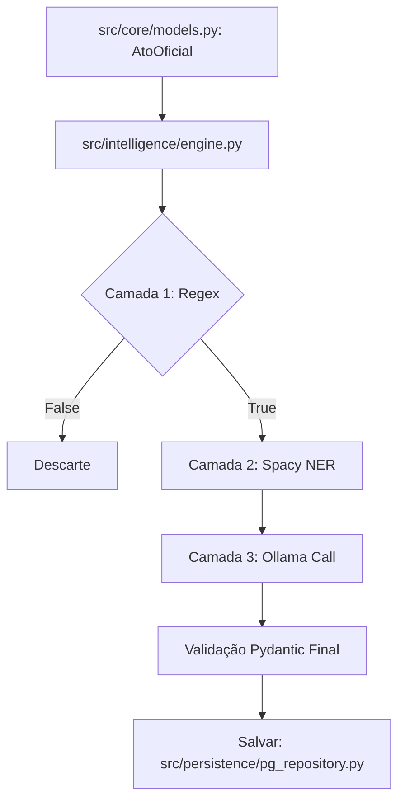

# Capítulo 02: Inteligência Artificial Local
> "Por que pedir permissão à nuvem, se você pode ser o mestre do seu próprio cérebro digital?"

## 🎓 O que você vai aprender?
* A diferença entre IA Generativa (LLMs) e NLP Estatístico (NER).
* A estratégia do "Funil de Inteligência" para economia de hardware.
* Como rodar o Ollama via Docker e baixar modelos.

---

## 1. O Duelo: LLM vs NER

No laboratório do DOE-BA, usamos dois tipos de "cérebros":

- **NLP Estatístico (Spacy/NER):** Um especialista em etiquetas. Muito rápido, reconhece nomes de pessoas, organizações e valores sem "pensar" muito.
- **IA Generativa (LLM/Ollama):** Um poliglota erudito. Entende o contexto, resume e traduz intenções complexas em JSON.

---

## 🔍 Mergulho no Código: O Funil em Ação

Toda a lógica de decisão reside em `src/intelligence/engine.py`. O fluxo segue um funil rigoroso para poupar seu hardware:

### Camada 1: O Filtro de Areia (Regex)
O método `camada_1_regex` utiliza expressões regulares para uma busca ultra-veloz. Se um texto não contém nenhuma palavra-chave da sua `watchlist.yaml`, ele é descartado imediatamente, salvando ciclos de GPU/CPU.

### Camada 2: O Filtro de Água (Spacy NER)
Se o texto for relevante, instanciamos o modelo `pt_core_news_sm` do **Spacy**. No arquivo `src/intelligence/engine.py`, o método `camada_2_spacy_ner` extrai entidades nomeadas. Isso nos dá uma estrutura básica (Pessoas e Órgãos) com custo computacional baixo.

### Camada 3: O Destilador (Ollama)
Quando a complexidade aumenta (ex: extrair valores de contratos complexos), o método `camada_3_ollama_fallback` dispara uma chamada assíncrona ao **Ollama**. 
- **Modelo:** `qwen2.5:1.5b`.
- **Segurança:** Após a resposta do LLM, os dados são validados novamente pelo **Pydantic** para garantir que a IA não "alucinou" um JSON quebrado.

---

## 3. Prática: O Coração Local (Ollama)

O Ollama roda dentro de um container Docker, isolado e seguro.

### Comandos de Mestre:
Para baixar o modelo que usamos, você abre o terminal e digita:
```bash
docker exec -it doe_ollama ollama pull qwen2.5:1.5b
```

---

## 4. Para Aprofundar

- **Pesquise por:** "NLP Named Entity Recognition (NER) vs LLM" para entender os trade-offs.
- **Estude o conceito:** "Pydantic output parsing for LLMs".

---



---
[Voltar para o Índice](README.md) | [Próximo Capítulo: RAG e Vetores](03-arquitetura-rag-e-vetores.md)
