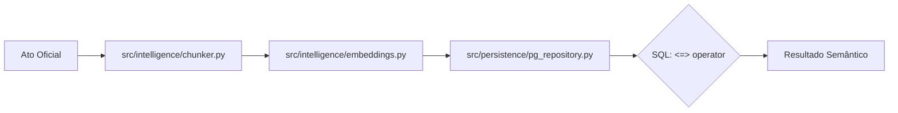

# Capítulo 03: Arquitetura RAG e Vetores
> "As palavras são apenas coordenadas em um mapa infinito de significados."

## 🎓 O que você vai aprender?
* O que é um Embedding (Vetor) de forma simplificada.
* Como a 'Similaridade de Cosseno' encontra textos sem usar palavras exatas.
* A importância do Overlap no Chunking de documentos.

---

## 1. Matemática Sem Dor: O que é um Embedding?

Imagine que cada palavra ou frase é uma estrela no céu. Estrelas que brilham sobre temas parecidos (ex: "Carro" e "Automóvel") ficam próximas no mapa estelar. Transformamos o texto em uma lista de números (vetor) para que o computador possa calcular a distância entre eles.

---

## 🔍 Mergulho no Código: O Pipeline de Vetores

### A. Fragmentação Inteligente (Chunking)
No arquivo `src/intelligence/chunker.py`, implementamos a função `chunk_text`. 
- **Lógica:** Dividimos o texto em blocos de **600 palavras**. 
- **Overlap (10%):** Deixamos 60 palavras de sobreposição entre um bloco e outro. Isso garante que se um nome próprio for cortado ao meio, ele aparecerá inteiro no próximo bloco, preservando o contexto vital para a busca.

### B. Vetorização Assíncrona
O arquivo `src/intelligence/embeddings.py` gerencia a interface com o modelo `nomic-embed-text` do Ollama. Cada fragmento de texto vira um vetor de **768 dimensões**.

### C. A Busca em Milissegundos
O segredo da performance está em `src/persistence/pg_repository.py`. Utilizamos o banco de dados PostgreSQL com a extensão **pgvector**. A busca semântica acontece através do operador `<=>`:
```sql
SELECT texto_chunk FROM atos_chunks 
ORDER BY embedding <=> $1::vector LIMIT 5;
```
Este operador calcula a **Similaridade de Cosseno** diretamente no banco de dados, permitindo encontrar temas correlatos em milissegundos, mesmo em bases com milhares de documentos.

---

## 4. Para Aprofundar

- **Pesquise por:** "HNSW (Hierarchical Navigable Small World) index no PostgreSQL" para entender como escalar buscas vetoriais.
- **Estude o conceito:** "Cosine Similarity vs Euclidean Distance".

---



---
[Voltar para o Índice](README.md) | [Próximo Capítulo: Infraestrutura e Operações](04-infraestrutura-e-operacoes.md)
