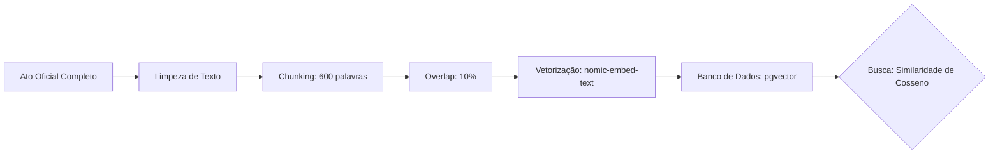

# Capítulo 03: Arquitetura RAG e Vetores
> "As palavras são apenas coordenadas em um mapa infinito de significados."

## 🎓 O que você vai aprender?
* O que é um Embedding (Vetor) de forma simplificada.
* Como a 'Similaridade de Cosseno' encontra textos sem usar palavras exatas.
* A importância do Overlap no Chunking de documentos.

---

## 1. Matemática Sem Dor: O que é um Embedding?

Imagine que cada palavra ou frase é uma estrela no céu. Estrelas que brilham sobre temas parecidos (ex: "Carro" e "Automóvel") ficam próximas no mapa estelar.

Um **Embedding** é simplesmente a latitude e longitude dessa estrela em um mapa de 768 dimensões. Transformamos o texto em uma lista de números para que o computador possa calcular a distância entre eles.

---

## 2. Similaridade de Cosseno (`<=>`)

Diferente de uma busca no Google (que busca a palavra exata), a **Similaridade de Cosseno** olha para a **direção** do vetor. 

- Se eu busco "Fraude em licitação", o sistema pode encontrar um texto que diz "Irregularidade no processo de compra", mesmo sem as palavras "fraude" ou "licitação", porque os vetores apontam para a mesma direção semântica.

---

## 3. Chunking e Overlap: A Arte de Não Cortar o Contexto

Não podemos dar um PDF de 500 páginas de uma vez para a IA. Precisamos cortá-lo em pedaços (**Chunks**).

### A Regra de Ouro: 600 palavras + 10% de Overlap
- **Chunking (600 palavras):** É o tamanho ideal para o modelo `nomic-embed-text` entender o parágrafo.
- **Overlap (60 palavras):** Imagine que você está cortando uma corda. Se você cortar exatamente no meio de uma frase importante, o sentido se perde. O overlap garante que o final do Pedaço A esteja no início do Pedaço B, mantendo a conexão entre as ideias.

---

## 4. Para Aprofundar

- **Pesquise sobre:** "HNSW (Hierarchical Navigable Small World)" no pgvector. É como criamos índices para buscas ultra-rápidas em milhões de vetores.
- **Estude o conceito:** "Retrieval-Augmented Generation (RAG)". Como a IA usa os pedaços que encontramos para gerar uma resposta precisa.

---

---
[Voltar para o Índice](README.md) | [Próximo Capítulo: Infraestrutura e Operações](04-infraestrutura-e-operacoes.md)
