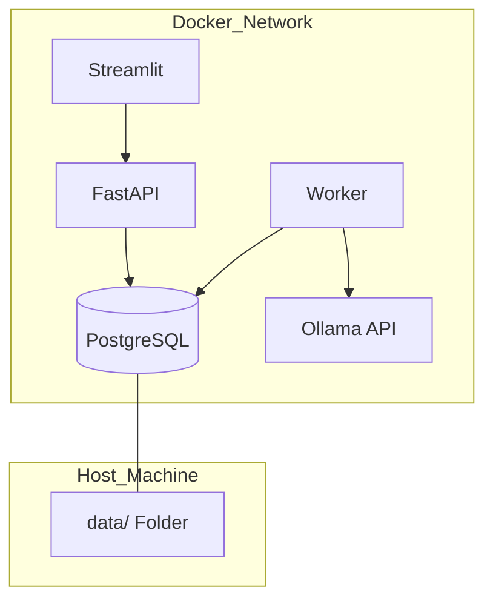

# Capítulo 04: Infraestrutura e Operações
> "Um castelo de inteligência só é forte se suas fundações forem sólidas."

## 🎓 O que você vai aprender?
* A orquestração dos 5 serviços vitais via Docker.
* A importância dos volumes persistentes na pasta `data/`.
* Como gerenciar segredos e configurações com o `.env`.

---

## 1. O Maestro: Docker Compose

O nosso sistema não é um único programa, mas uma **orquestra** de 5 músicos que precisam tocar em sincronia:

1.  **db (O Arquivo):** PostgreSQL com pgvector para guardar textos e vetores.
2.  **ollama (O Cérebro):** Onde os modelos de IA vivem e processam dados.
3.  **api (O Tradutor):** Serve os dados para o mundo via FastAPI.
4.  **worker (O Operário):** O motor que raspa e processa os dados em segundo plano.
5.  **ui (A Vitrine):** O dashboard Streamlit para você interagir com os dados.

---

## 2. Persistência: Onde as memórias vivem

Containers Docker são voláteis: se você apagá-los, tudo o que está dentro some. Por isso usamos **Volumes**.
- Toda a nossa base de dados e logs são mapeados para a pasta local `data/`. 
- **Regra de Ouro:** Nunca apague a pasta `data/` sem ter um backup. Ela é a memória de longo prazo do seu sistema.

---

## 3. Segurança e Configuração: O Arquivo `.env`

Imagine o `.env` como o **cofre** do seu projeto. Nele guardamos:
- Senhas do banco de dados.
- URLs de APIs.
- Chaves secretas.

### O Arquivo `.env.example`
Sempre fornecemos um mapa do cofre vazio (`.env.example`). Você deve copiá-lo para `.env` e preencher com suas credenciais reais. **Nunca suba o seu `.env` para o GitHub!**

---

## 4. Para Aprofundar

- **Pesquise sobre:** "Docker Healthchecks". Como o sistema sabe se o Banco de Dados está realmente pronto para receber conexões.
- **Estude o conceito:** "Infrastructure as Code (IaC)".
- **Desafio:** Tente adicionar um serviço de monitoramento como o **Glances** ou **Portainer** ao seu `docker-compose.yml`.

---

---
[Voltar para o Índice](README.md)
