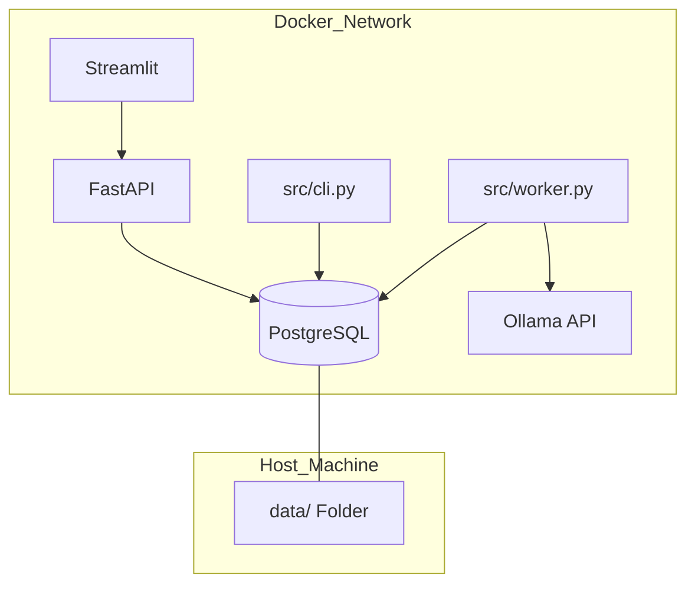

# Capítulo 04: Infraestrutura e Operações
> "Um castelo de inteligência só é forte se suas fundações forem sólidas."

## 🎓 O que você vai aprender?
* A orquestração dos 5 serviços vitais via Docker.
* A importância dos volumes persistentes na pasta `data/`.
* Como gerenciar segredos e configurações com o `.env`.

---

## 🔍 Mergulho no Código: O Orquestrador e o Operário

Nesta camada, saímos da matemática e entramos na engenharia bruta:

### A. O Loop Infinito (Worker)
O arquivo `src/worker.py` é o coração pulsante do sistema. Ele orquestra o ciclo contínuo:
1.  Verifica o banco (`src/persistence/pg_repository.py`) em busca de novos atos.
2.  Chama o motor de inteligência (`src/intelligence/engine.py`).
3.  Gera chunks e embeddings.
4.  Aguardam o tempo de polling definido no `.env`.

### B. O Painel de Controle (CLI)
Para testes manuais sem subir toda a infraestrutura, usamos o `src/cli.py`. Ele permite que o desenvolvedor execute comandos isolados para validar a extração de um ato específico ou forçar uma sincronização.

### C. Orquestração Docker
O arquivo `docker-compose.yml` define como os 5 serviços se conectam. Um ponto vital é o mapeamento de volumes persistentes:
- `data/logs/`: Rastreabilidade de erros do scraper.
- `data/backups/`: Snapshots do banco de dados vetorial.
- `data/temp/`: Processamento temporário de PDFs pesados.

---

## 2. Persistência: Onde as memórias vivem

Containers Docker são voláteis: se você apagá-los, tudo o que está dentro some. Por isso usamos **Volumes**.
- Toda a nossa base de dados e logs são mapeados para a pasta local `data/`. 
- **Regra de Ouro:** Nunca apague a pasta `data/` sem ter um backup. Ela é a memória de longo prazo do seu sistema.

---

## 3. Segurança e Configuração: O Arquivo `.env`

Sempre fornecemos um mapa do cofre vazio (`.env.example`). Você deve copiá-lo para `.env` e preencher com suas credenciais reais. **Nunca suba o seu `.env` para o GitHub!**

---

## 4. Para Aprofundar

- **Pesquise por:** "Docker Container Healthchecks" para entender como o `worker` aguarda o `db` ficar pronto.
- **Estude o conceito:** "Infrastructure as Code (IaC)".

---

---
[Voltar para o Índice](README.md)
